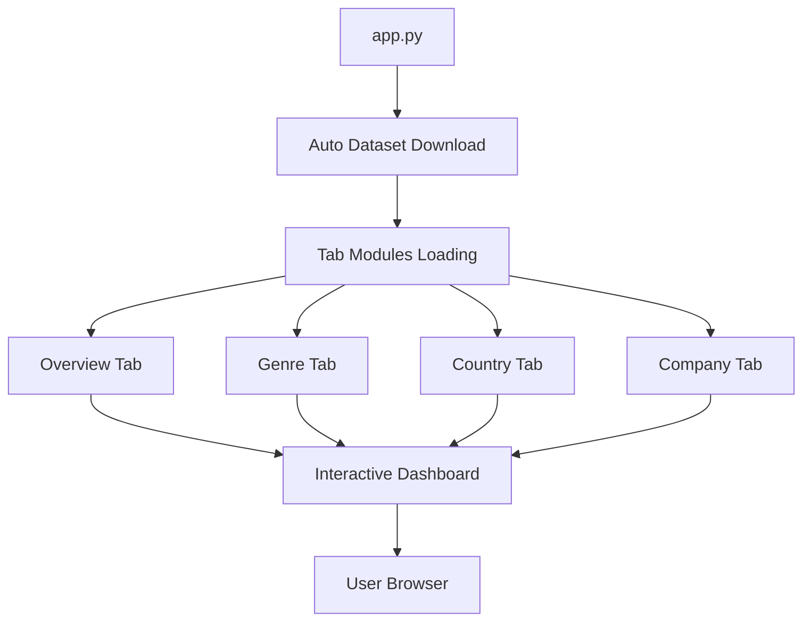

# 🎬 CineScope - Movie Analytics Dashboard

<div align="center">


### *🚀 Interactive Web Dashboard for Comprehensive Movie Industry Analysis*
*Powered by TMDB Dataset • Built with Dash & Plotly • 900,000+ Movies Analyzed*
</div>

---

## 🌟 What is CineScope?

CineScope is a **powerful, interactive web dashboard** that transforms raw movie data into actionable insights. Built for movie industry professionals, data analysts, and cinema enthusiasts, it provides deep analytics across **genres, countries, production companies, and movie metrics** using The Movie Database (TMDB) dataset.

### 🎯 **Key Highlights**
- ✅ **900,000+ Movies** analyzed from 1940-2023
- ✅ **Auto-downloading dataset** - no manual setup required
- ✅ **4 Comprehensive Analysis Tabs** with 15+ interactive visualizations
- ✅ **Real-time filtering** and dynamic updates
- ✅ **Mobile-responsive design** with professional UI
- ✅ **One-click deployment** - just run `python app.py`

## ✨ Features & Capabilities

<table>
<tr>
<td width="50%">

### 🏠 **Overview Analytics Hub**
- 📊 **Movies Per Year**: Interactive timeline (1940-2023)
- 🌅 **Genre Sunburst**: Hierarchical genre distribution  
- 🔥 **Correlation Heatmap**: Movie metrics relationships
- 🌊 **Symmetric Streamgraph**: Genre evolution over time
- ⭐ **Runtime vs Rating**: Quality-duration analysis

</td>
<td width="50%">

### 🎭 **Genre Deep Dive**
- 🎯 **Interactive Selection**: Dropdown genre filtering
- 📈 **Trend Analysis**: Genre performance metrics
- 🔄 **Comparative View**: Cross-genre insights
- 📊 **Custom Visualizations**: Genre-specific charts
- 🎨 **Dynamic Updates**: Real-time data filtering

</td>
</tr>
<tr>
<td width="50%">

### 🌍 **Global Country Analysis**
- 🗺️ **World Map**: Global movie production visualization
- 🏆 **Top 10 Rankings**: Leading production countries
- 💰 **ROI Analysis**: Investment return by country
- 📊 **Performance Metrics**: Revenue, budget, popularity
- 🔍 **Country Spotlight**: Detailed country profiles

</td>
<td width="50%">

### 🏢 **Studio & Company Insights**
- 🎬 **Production Giants**: Major studio analysis
- 💼 **Performance Dashboard**: Revenue & ROI metrics
- 🎨 **Genre Distribution**: Studio specialization patterns
- ⚖️ **Comparative Analysis**: Studio vs studio metrics
- 📈 **Market Share**: Industry positioning insights

</td>
</tr>
</table>

## 🏗️ Project Structure

```
CineScope_CS661/
├── app.py                      # Main application file with auto-download
├── requirements.txt            # Python dependencies
├── assets/
│   └── style.css              # Custom styling and layout
├── tabs/
│   ├── __init__.py            # Package initialization
│   ├── overview.py            # Overview dashboard logic
│   ├── genre.py               # Genre analysis functionality
│   ├── country.py             # Country-wise analysis
│   ├── company.py             # Production company analysis
│   └── TMDB_movie_dataset_v11.csv  # Auto-downloaded dataset
└── README.md                   # Project documentation
```

## 🚀 Quick Start Guide

### 📋 Prerequisites
- 🐍 **Python 3.8+** 
- 🌐 **Internet connection** (for automatic dataset download)
- 💾 **600MB free space** (for dataset storage)

### ⚡ Installation & Launch

```bash
# 1️⃣ Clone the repository
git clone <your-repository-url>
cd CineScope_CS661

# 2️⃣ Install dependencies  
pip install -r requirements.txt

# 3️⃣ Launch the application
python app.py

# 4️⃣ Open your browser
# Navigate to: http://127.0.0.1:8050
```

### 🎉 **That's it!** 
The app will automatically:
- ✅ Download the TMDB dataset (565MB) 
- ✅ Process and prepare the data
- ✅ Launch the interactive dashboard
- ✅ Open in your default browser

<div align="center">

### 🎬 **Ready to explore 900,000+ movies?**
**Click through the sidebar tabs to start your analysis journey!**

</div>

## 📊 Dataset Information

<div align="center">

### 🎯 **TMDB Movie Dataset v11**
*The most comprehensive movie database for analytics*

</div>

<table align="center">
<tr>
<td align="center"><strong>📈 Records</strong><br/>900,000+ Movies</td>
<td align="center"><strong>📅 Time Range</strong><br/>1940 - 2023</td>
<td align="center"><strong>💾 Size</strong><br/>565 MB</td>
<td align="center"><strong>🔄 Updates</strong><br/>Automatic Download</td>
</tr>
</table>

### 📋 **Data Attributes**
| Category | Attributes |
|----------|------------|
| **🎬 Basic Info** | Title, Release Date, Runtime, Language |
| **💰 Financial** | Budget, Revenue, ROI, Profit Margins |  
| **⭐ Quality Metrics** | TMDB Rating, Vote Count, Popularity Score |
| **🎭 Content** | Genres, Keywords, Taglines, Overviews |
| **🌍 Production** | Countries, Companies, Cast, Crew |
| **📊 Computed** | Year Categories, Genre Explosions, Performance Ratios |

### 🤖 **Smart Auto-Download System**
```python
# Intelligent dataset management
✅ Automatic download from Google Drive
✅ Virus scan handling for large files  
✅ Smart caching (downloads only if missing)
✅ Progress tracking with status updates
✅ Error handling with fallback options
```

**Source**: [Kaggle Dataset](https://www.kaggle.com/datasets/asaniczka/tmdb-movies-dataset-2023-930k-movies)  
**Storage**: `tabs/TMDB_movie_dataset_v11.csv`

## 🛠️ Technical Architecture & Stack

<div align="center">

### 🏗️ **Built with Industry-Leading Technologies**

</div>

<table>
<tr>
<td width="50%">

#### 🎨 **Frontend & Visualization**
- **[Dash](https://dash.plotly.com/)** - Web application framework
- **[Plotly](https://plotly.com/python/)** - Interactive visualizations  
- **CSS Grid** - Responsive layout system
- **HTML5/CSS3** - Modern web standards

#### 📊 **Data Processing & Analytics**
- **[Pandas](https://pandas.pydata.org/)** - Data manipulation powerhouse
- **[NumPy](https://numpy.org/)** - Numerical computing foundation
- **Python 3.8+** - Core programming language

</td>
<td width="50%">

#### 🔧 **System & Infrastructure**
- **[gdown](https://github.com/wkentaro/gdown)** - Google Drive integration
- **[requests](https://docs.python-requests.org/)** - HTTP handling
- **Modular Architecture** - Scalable tab system
- **Auto-deployment** - Zero-config setup

#### 🎯 **Key Design Patterns**
- **📦 Modular Components** - Each tab is independent
- **🔄 Callback Architecture** - Event-driven interactions  
- **🎨 Responsive Design** - Mobile-first approach
- **⚡ Performance Optimized** - Efficient data processing

</td>
</tr>
</table>

### 🏗️ **System Architecture**



### 📁 **Project Structure**
```
CineScope_CS661/
├── 🚀 app.py                     # Main application & auto-download
├── 📋 requirements.txt           # Dependencies management
├── 🎨 assets/
│   └── style.css                 # Professional styling
├── 📊 tabs/
│   ├── __init__.py              # Module initialization  
│   ├── overview.py              # 🏠 Overview analytics
│   ├── genre.py                 # 🎭 Genre deep-dive
│   ├── country.py               # 🌍 Global analysis  
│   ├── company.py               # 🏢 Studio insights
│   └── TMDB_movie_dataset_v11.csv  # 📁 Auto-downloaded data
└── 📖 README.md                  # Documentation
```

## � Visualization Showcase

<div align="center">

### 🎨 **15+ Interactive Chart Types**
*From basic analytics to advanced multi-dimensional visualizations*

</div>

| Visualization Type | Purpose | Tab Location |
|-------------------|---------|--------------|
| 📊 **Interactive Bar Charts** | Movie counts, revenue comparisons | All Tabs |
| 📈 **Trend Line Charts** | Time-series analysis, evolution tracking | Overview, Genre |
| 🎯 **Scatter Plots** | Correlation analysis, quality metrics | Overview, Country |
| 🔥 **Correlation Heatmaps** | Variable relationship mapping | Overview |
| 🌅 **Sunburst Charts** | Hierarchical data exploration | Overview |
| 🌊 **Streamgraphs** | Flow visualization over time | Overview |
| 🗺️ **Choropleth Maps** | Global geographic analysis | Country |
| 📊 **Multi-dimensional Plots** | Complex relationship analysis | All Tabs |

### 🎭 **Advanced Interactive Features**
- ✅ **Real-time filtering** with dropdown controls
- ✅ **Dynamic data updates** based on user selections  
- ✅ **Hover tooltips** with detailed information
- ✅ **Zoom and pan** capabilities on all charts
- ✅ **Export functionality** for reports and presentations
- ✅ **Mobile-responsive** design for all screen sizes

---

## 🔧 Customization & Configuration

<table>
<tr>
<td width="50%">

### 🎨 **Styling Customization**
```css
/* assets/style.css */
.sidebar {
    background-color: #2c3e50;
    /* Customize colors */
}

.content {
    margin-left: 240px;
    /* Adjust layout */
}
```

</td>
<td width="50%">

### 📊 **Data Configuration**
```python
# app.py - Change dataset source
file_id = "your_google_drive_file_id"

# Any tab file - Update genre selection
available_genres = [
    'Animation', 'Comedy', 'Drama',
    'Action', 'Thriller', 'Horror'
]
```

</td>
</tr>
</table>

### ⚙️ **Advanced Settings**
- **🎯 Genre Filtering**: Modify `available_genres` in tab files
- **📅 Date Ranges**: Adjust year filters in visualization functions  
- **🎨 Color Schemes**: Update Plotly color scales in chart definitions
- **📊 Chart Dimensions**: Modify width/height in `fig.update_layout()`
- **🔄 Auto-refresh**: Add timers for real-time data updates

## 🔍 Key Analytics & Business Insights

<div align="center">

### 🎯 **Actionable Intelligence from 900,000+ Movies**

</div>

<table>
<tr>
<td width="33%">

#### 📈 **Industry Trends**
- **🚀 Production Boom**: 300% growth since 2000
- **🎭 Genre Shifts**: Rise of action/adventure  
- **🌍 Global Expansion**: International co-productions
- **💰 Budget Inflation**: Average costs trending up
- **⭐ Quality Metrics**: Rating patterns by era

</td>
<td width="33%">

#### 💼 **Business Intelligence**
- **🎯 ROI Optimization**: Best performing characteristics
- **📊 Market Analysis**: Country-wise opportunities
- **🏢 Studio Performance**: Competitive positioning
- **💡 Investment Insights**: Budget vs revenue patterns
- **🎪 Genre Profitability**: Revenue per genre analysis

</td>
<td width="33%">

#### 🌟 **Strategic Findings**
- **📅 Seasonal Patterns**: Release timing optimization
- **🎬 Duration Analysis**: Runtime vs success correlation
- **👥 Audience Preferences**: Rating distribution insights
- **🌐 Geographic Trends**: Regional production analysis
- **⚡ Market Dynamics**: Industry evolution tracking

</td>
</tr>
</table>

---

### 💡 **How to Contribute**

1. **🍴 Fork the Repository**
   ```bash
   git fork https://github.com/your-username/CineScope_CS661
   ```

2. **🌿 Create Feature Branch**
   ```bash
   git checkout -b feature/AmazingNewFeature
   ```

3. **✨ Make Your Changes**
   - Add new visualizations
   - Improve existing analytics
   - Enhance UI/UX design
   - Fix bugs or performance issues

4. **📝 Commit & Push**
   ```bash
   git commit -m "✨ Add amazing new feature"
   git push origin feature/AmazingNewFeature
   ```

## � License & Legal

This project is licensed under the **MIT License** - see the [LICENSE](LICENSE) file for complete details.

### 🎯 **Usage Rights**
- ✅ **Commercial Use** - Use in commercial projects
- ✅ **Modification** - Adapt and customize freely  
- ✅ **Distribution** - Share with attribution
- ✅ **Private Use** - Use in private projects

---

## 🙏 Acknowledgments & Credits

<div align="center">

### 🌟 **Special Thanks**

</div>

<table align="center">
<tr>
<td align="center">
  <strong>🎬 TMDB</strong><br/>
  <em>Comprehensive movie dataset</em>
</td>
<td align="center">
  <strong>📊 Plotly Team</strong><br/>
  <em>Excellent visualization library</em>
</td>
<td align="center">
  <strong>🚀 Dash Community</strong><br/>
  <em>Powerful web framework</em>
</td>
<td align="center">
  <strong>👥 Contributors</strong><br/>
  <em>Amazing community support</em>
</td>
</tr>
</table>

---

### 🔧 **Troubleshooting Quick Guide**

```bash
# Common issues & solutions

# Issue: Module not found
pip install -r requirements.txt

# Issue: Dataset download fails  
# Manual download from Google Drive link in console output

# Issue: Port already in use
python app.py --port 8051

# Issue: Performance slow
# Reduce data range in visualization functions
```
## 👥 **Contributors**

| Name | Name | Name | Name |
|------|------|------|------|
| [Aryaman Srivastava](#) | [Aryan Deo](#) | [Harshita Awasthi](#) | [Kshitiz Tyagi](https://github.com/Kshitiztyagi23) |
| [Om Bhartiya](#) | [Saumitra Raaj](#) | [Swarnim Verma](#) | [Tejas Shrivastava](https://github.com/AlphaTS-01) |

---

*CineScope v2.0 • Last Updated: July 2025 • Made with Python & Dash*

</div>
